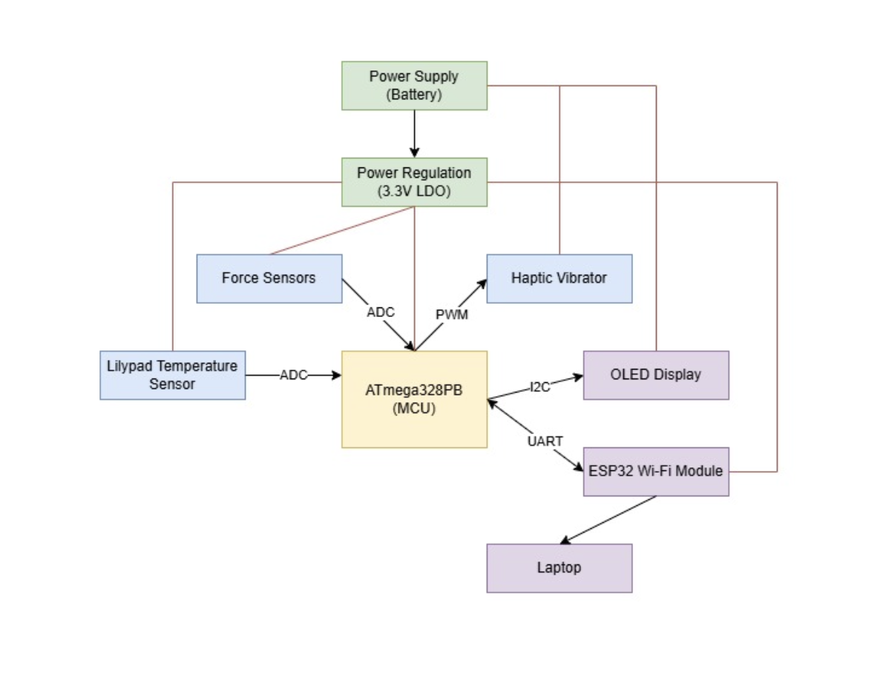
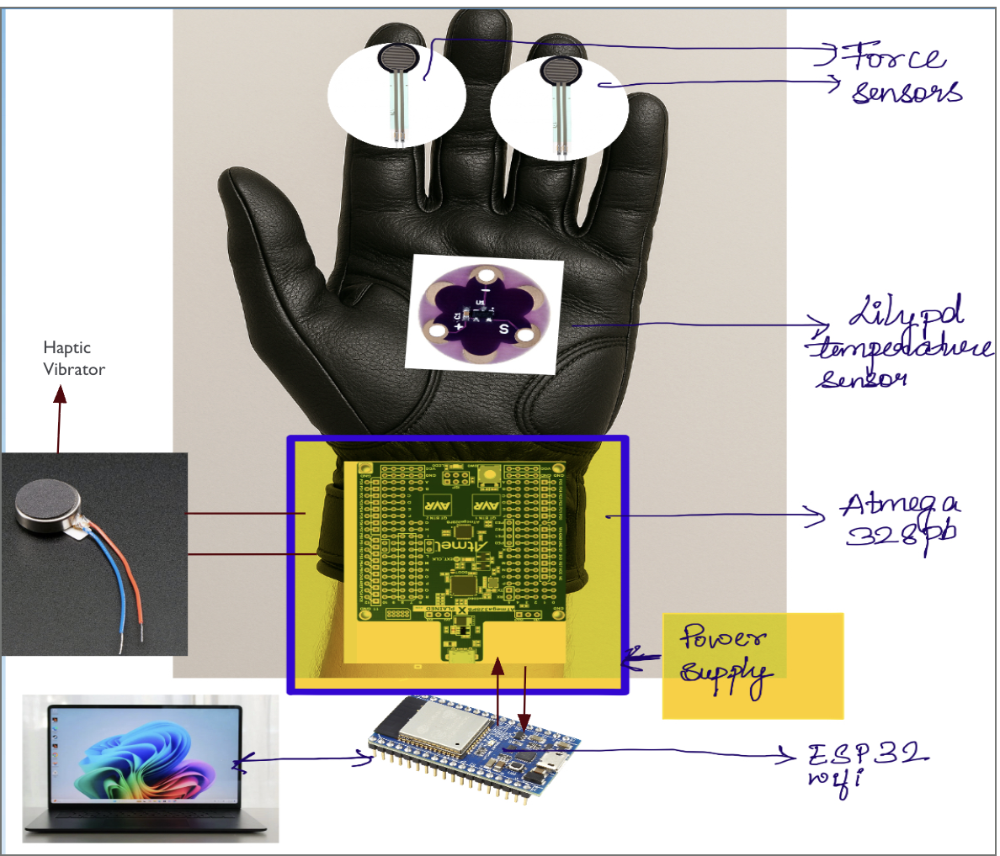
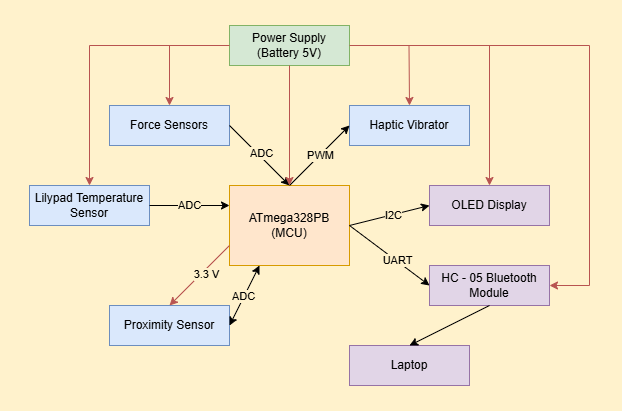
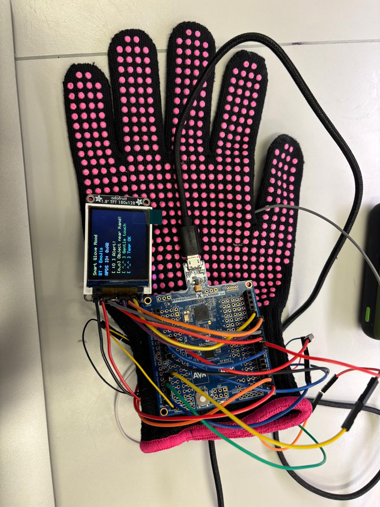
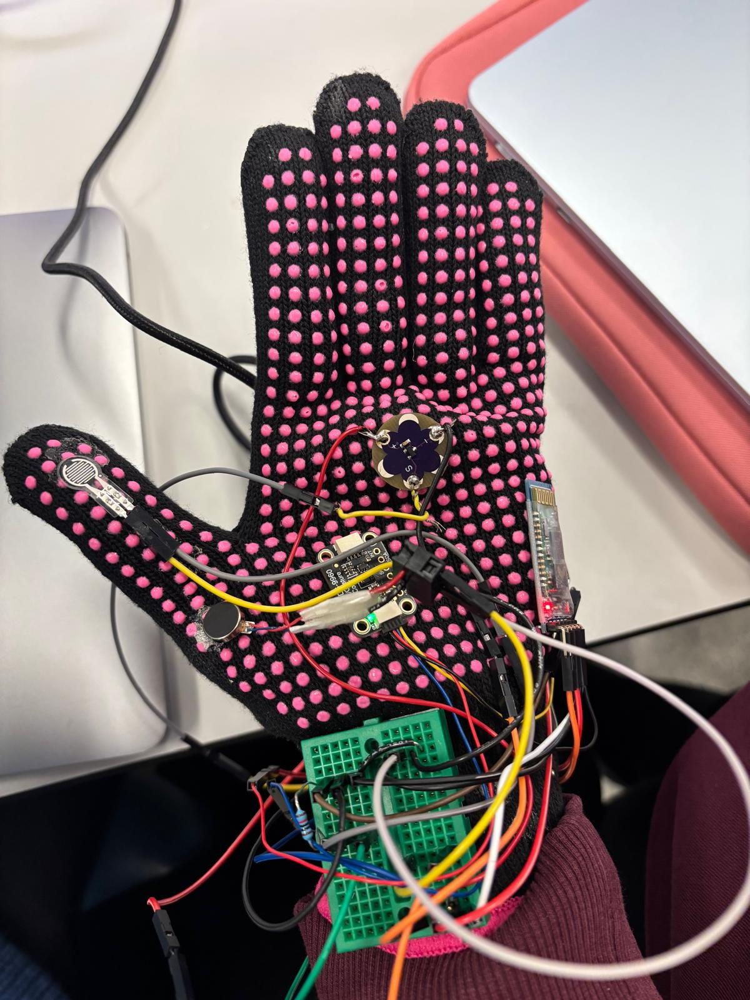

# NeuroTouch

**Team Number: 12 **

**Team Name: Tri-State Buffers**

| Team Member Name           | Email Address           |
| -------------------------- | ----------------------- |
| Ananya Shivarama Bhat      | ananya9@seas.upenn.edu  |
| Anushka Jain               | anushkaj@seas.upenn.edu |
| Devanshi Kalpeshbhai Patel | patel5@seas.upenn.edu   |

**GitHub Repository URL: https://github.com/upenn-embedded/final-project-f25-f25_final_project_t12_tri-state_buffers**

**GitHub Pages Website URL:** [NeuroTouch Website](https://neurotouch.streamlit.app/)

## Final Project Proposal

### 1. Abstract

Individuals with congenital insensitivity to pain or loss of touch sensation lack the sensory feedback needed to safely interact with their environment. This project proposes a Smart Haptic Glove that restores a sense of touch awareness using a compact embedded system built around the ATmega328PB microcontroller. Each glove hand integrates multiple force-sensitive resistors (FSRs) for contact pressure, a precision temperature sensor (MCP9700) for surface heat detection and ERM haptic motors (P1012 class) that reproduce tactile feedback through vibrations proportional to force or temperature. A low-power OLED display provides real-time sensor data and system status. The system runs on NiMH AA batteries with on-board power regulation and noise filtering, ensuring full compliance with laboratory safety requirements. The glove’s firmware performs continuous analog sampling, threshold detection and PWM-based haptic control while employing sleep and duty-cycling techniques for efficient power management. The end goal is a lightweight, wearable assistive device that enables users without tactile sensation to perceive pressure and temperature cues safely and intuitively.

### 2. Motivation

People affected by **Congenital Insensitivity to Pain with Anhidrosis (CIPA)** or other neuropathic conditions lack the ability to feel **pain, temperature, or touch**—fundamental sensations that protect the body from harm. Everyday tasks such as holding a hot object, applying pressure, or gripping tools can result in severe injuries without the person realizing it.

Our motivation is to **restore safe sensory awareness** through an assistive wearable device that translates real-world stimuli into **intelligent haptic feedback**. Rather than simply detecting hazards, the glove allows the user to *feel* through controlled vibrations and cues—making safety instinctive again.

The project also serves as a **demonstration of embedded systems integration**, combining analog sensing, PWM motor control and real-time signal processing on a compact **ATmega328PB** platform. By designing a power-efficient, sensor-rich glove that operates entirely on **safe NiMH batteries**, we aim to create an accessible, wearable prototype that showcases how embedded technology can bridge the gap between human perception and digital intelligence.

Ultimately, this project is driven by two goals:

1. **Human impact** — improving quality of life for individuals who have lost tactile perception.
2. **Engineering innovation** - proving that low-cost embedded systems can deliver meaningful assistive technology when designed thoughtfully.

### 3. System Block Diagram

### 4. Design Sketches

We anticipate our final product to look like this

### 5. Software Requirements Specification (SRS)

The software for the Smart Haptic Glove is responsible for reading sensor data, interpreting physical contact and temperature levels, and producing real-time haptic, visual, and wireless feedback. The program shall continuously read values from all force sensors and the MCP9700 temperature sensor at least twenty times per second to ensure timely response. The readings will be processed so that small fluctuations are smoothed, keeping the displayed or acted-upon value steady when the finger is held still. When the pressure on any finger exceeds a preset threshold or when the surface temperature rises above 45 °C, the firmware shall immediately trigger the vibration motor for that finger, providing distinct feedback patterns for force and temperature. The delay between detecting a hazard and starting vibration shall be less than 50 milliseconds. The vibration intensity shall scale with applied force—light, medium, and firm pressure will correspond to low, medium, and high vibration strengths.

An OLED display will show live data such as temperature, average pressure level, and battery status, refreshing at least five times per second and automatically dimming after ten seconds of inactivity to conserve power. The system shall also transmit diagnostic and sensor data through an integrated ESP32 Wi-Fi module, which will communicate with a laptop or cloud dashboard in real time. The data packets—containing pressure, temperature, vibration intensity, and battery information—will be updated at least once per second for remote monitoring and analysis. A simple UART interface will handle communication between the ATmega328PB and ESP32 to ensure reliable data transfer. When idle, with no haptic activity and the OLED dimmed, the firmware shall enter a reduced-power state to keep average current consumption below 35 mA. Together, these requirements ensure that the glove reacts quickly and reliably to user interaction, provides meaningful tactile and visual feedback, enables wireless connectivity for external monitoring, and maintains efficient power use suitable for battery operation.

**5.1 Definitions, Abbreviations**

ESP 32 abreviation : The ESP32 is a small and powerful microcontroller made by Espressif that has built-in Wi-Fi and Bluetooth, making it perfect for Internet of Things (IoT) and embedded system projects. It works like a tiny computer that can read data from sensors, process it, and send or receive information from other devices or the internet. In our case, we are trying to establish communication with the ESP32 so that it can exchange data with another system, like a computer or another microcontroller. The most common way to do this is through serial (UART) communication, where data is sent and received using the TX (transmit) and RX (receive) pins. This allows us to send commands to the ESP32 and get responses back, often through a USB or serial connection. Once this basic connection is working, we can also explore other communication methods like I2C, SPI, or even wireless options such as Wi-Fi and Bluetooth for more advanced applications.
OLED : An OLED display is useful because it gives the user and developers real-time visual feedback about the glove’s operation. For example, the OLED can show sensor readings like temperature, pressure, or vibration intensity, so the user (or clinician) can see what the glove is detecting even if they can’t physically feel it. It also helps during testing and debugging, allowing you to confirm that the sensors and haptic motors are responding correctly.
So, the need for the OLED in your project is to display live sensor data and system status, making it easier to monitor performance, ensure safety, and provide a clear interface for the user. It turns invisible sensor activity into something visible and understandable  which is especially important for a project centered on restoring sensory awareness.

### 6. Hardware Requirements Specification (HRS)

Our device, the CIPA glove, must be able to sense temperature and pressure from the environment and alert the user before any potential harm occurs. It should detect when something is too hot, too cold, or when excessive pressure is applied, and then trigger a haptic vibration to warn the user. The glove must also display real-time sensor readings on the OLED screen so that users or caregivers can visually monitor the conditions. Overall, it should work quickly, accurately, and reliably to provide safe tactile feedback for people who cannot feel pain or touch, helping them avoid injuries in everyday situations.

During validation testing, we will measure how accurately and reliably the glove works. We will test whether it can correctly detect temperature and pressure and if the haptic motor and OLED display respond properly. For temperature, we will compare the glove’s readings with a thermometer to see if they match. For pressure, we will press the sensors using known weights or a force gauge and check how close the glove’s readings are. We will also test how quickly the glove responds after detecting a change, by measuring the time between the input and the motor or display reaction. The OLED screen will be checked to make sure it shows the correct data clearly and in real time. Finally, we will repeat these tests many times to see if the system remains consistent and reliable. All these results—accuracy, speed, and reliability—will help us confirm that the glove performs safely and effectively.

**6.1 Definitions, Abbreviations**

ADC : In our project, the ADC (Analog-to-Digital Converter) plays an important role in allowing the glove to understand signals from the sensors. The temperature and pressure sensors used in the CIPA glove produce analog signals, which are continuous voltage levels that change depending on what they sense — for example, higher voltage for higher temperature or pressure. However, the microcontroller (like the ATmega328PB or ESP32) can only process digital signals (0s and 1s). The ADC converts these analog voltages into digital values that the microcontroller can read and interpret.

**6.2 Functionality**

| ID                        | Description                                                                                                                                                                                                                                                                                                                                                                                                                             |
| ------------------------- | --------------------------------------------------------------------------------------------------------------------------------------------------------------------------------------------------------------------------------------------------------------------------------------------------------------------------------------------------------------------------------------------------------------------------------------- |
| 1027-1001-ND (Digikey)    | It offers an analog resistive output that changes with applied force (i.e., the more pressure you apply, the lower the resistance). The manufacturer lists a response time of approximately 3 µs, which means it reacts very quickly to changes in force.                                                                                                                                                                              |
| MCP9700                   | The LilyPad Temperature Sensor is a small, wearable-friendly sensor that measures temperature and gives an analog voltage output that changes with temperature. It uses the MCP9700 chip, which outputs about 0.5 V at 0 °C and increases by around 10 mV for every degree Celsius rise in temperature.                                                                                                                                |
| 100614                    | The Adafruit Vibrating Mini Motor Disc (Product ID 1201) is a small, sealed vibration motor that’s ideal for adding haptic feedback in projects. It has a diameter of about 10 mm, a thickness of about 2.7 mm and operates from roughly 2 V up to about 5 V.                                                                                                                                                                          |
| NHD-C12832A1Z-FSW-FBW-3V3 | It uses an SPI interface for easy communication with a microcontroller and has a transflective FSTN screen, which means it’s clear to read in both bright and low-light conditions. It runs on 3.3 V and is compact, making it ideal for portable or wearable projects. In our glove project, it can be used to show sensor readings, temperature, or warning messages, giving the user a quick visual update of the system’s status. |

### 7. Bill of Materials (BOM)

This is the link to our Bill of Materials : [Link to Bill of Materials](https://docs.google.com/spreadsheets/d/1QtdVStObCcLbVKRbtt4f56HXiCSugzFT5HUSX2p0JdM/edit?gid=0#gid=0)

### 8. Final Demo Goals

For the final demonstration, our Smart Haptic Glove will be worn by a team member to showcase how touch and temperature can be sensed, interpreted and transmitted wirelessly in real time. The glove will detect pressure through multiple FSR sensors and surface heat via an MCP9700 temperature sensor. These signals will be processed by the ATmega328PB, which controls vibration motors and sends live data to an ESP32 module for wireless transmission. The ESP32 will relay this data over Wi-Fi to a laptop dashboard or web interface, displaying real-time readings of pressure levels, temperature and motor activity.

During the demo, we will present two modes of feedback: (1) local tactile feedback, where the glove vibrates immediately in response to sensed force or temperature; and (2) remote visualization, where sensor data appears live on the Wi-Fi dashboard. This demonstrates both the glove’s assistive sensory function and its IoT data capability for potential medical or research use. The OLED display on the glove will simultaneously show sensor values and system status, while the vibration motors will produce distinct patterns for pressure and heat, illustrating intuitive feedback mapping.

The demonstration will take place indoors, with a wearable setup powered by AA NiMH batteries and a USB interface for debugging. We will show the glove interacting with various objects—pressing soft and hard surfaces and touching warm materials in order to highlight real-time wireless data transfer, haptic response and low-power operation. This will effectively demonstrate a complete embedded system that bridges human sensory feedback and wireless communication, offering a proof-of-concept for assistive smart wearables.

### 9. Sprint Planning

| Milestone  | Functionality Achieved                                                                                                                                                                                                                                                                                                                                         | Distribution of Work                                                                                                                                    |
| ---------- | -------------------------------------------------------------------------------------------------------------------------------------------------------------------------------------------------------------------------------------------------------------------------------------------------------------------------------------------------------------- | ------------------------------------------------------------------------------------------------------------------------------------------------------- |
| Sprint #1  | We plan to obtain all senors and establish connections. We also plan to setup the power system. We will also consider if we need to 3D print any particular object for the final device. In accordance to this, we will also design on a relevant software.                                                                                                    | We have divided smaller tasks between us like assigning who would create the BOM and find the sensors. Overall, we plan to work on the project together |
| Sprint #2  | We plan to write our firmware and test it for different cases of pressure and temperatures and setup ESP32 for communication. For all the problems that we would encounter, we would consult our account manager for advice. Incase we are able to achieve all the functionality that is desires, we plan to add additional features to the product as needed. | We plan to work together while writing the firmware                                                                                                     |
| MVP Demo   | We expect to see all electronics and firmware working at a basic level. We would explain our firmware implementation, including application logic and critical drivers that we have written and would demo our device.                                                                                                                                         | On our demo, all of us would show our work to our account manager and cater to any problems that we are facing                                          |
| Final Demo | We expect to cater all the possible requirements of the project and display our results. We hope to satisfy our purpose of the project                                                                                                                                                                                                                         | We would work on the final demo and present together to all the TAs and students                                                                        |

**This is the end of the Project Proposal section. The remaining sections will be filled out based on the milestone schedule.**

## Sprint Review #1

### Last week's progress

In the past week, we started off by meeting Kevin and ordering all our parts which would be needed for the final project. Accordingly the BOM was made as well. We also found some force sensors in Detkin that would be used in our project. The force sensors were checked and tested using arduino uno. It was interfaced with atmega .

We planned to include IR proximity sensors in addition to the sensors we already included in the intial plan.

The IR proximity sensors will communicate with the Atmega through I2C. The functionality of these sensors was also verified with the Atmega 328Pb.

### Current state of project

We are currently waiting on the parts which we have ordered.

Meanwhile we have set up the force sensors and the IR proximity sensors and have written the code for that.

We are coding for the temperature sensors and trying to explore the coding for the LilyPad Dev board

### Next week's plan

Test the sensors.

Use and test the e-sewing technique.

Code and explore the set up with the Lilypad Dev board.

Integrate the circuit with the gloves.

Test the Haptic Vibrator.

## Sprint Review #2

### Last week's progress

We ordered the parts i.e. sensors, gloves and other parts.

We also tested force sensors and IR procimity sensors and wrote a code for that.

### Current state of project

Picked up the ordered parts.

Tested the lily pad sensor and haptic vibrator.

We assembeled everything together and integrated it all together and wrote code for it.

The haptic vibrator did start to vibrate when it reached a certain temperature that is coded.

Explored E-sewing. E-sewing was deemed to be unsuitable, due to the repeated shorting. Gloves are thick and using for the multiple connections will increase chances for fire hazard.

Organized glove with all sensors, decided position of the sensors. All sensors work well togethetr.
Making things look visually appealing is what we are focussing on now.

[Link to our sprint 2 video](https://drive.google.com/file/d/1BpGGhQza-djSmU92A-6jknkhLnuqGChL/view?usp=sharing)

### Next week's plan

Solder the sensors onto the perfboard. Solder wires onto the sensors.

Organize everything together on the glove and prepare the final product for the demonstration.

Preparing for MVP demo in the upcoming week.

## MVP Demo

1. Show a system block diagram & explain the hardware implementation.

Answer : This is our updated block diagram.

In our current hardware implementation, we havent used an LDO so far. The main power source has been the 5V battery. Apart from this we also tested the glove using a power bank and it seemed to work pretty well. While testing, we used only 1 force sensor which was placed at the thumb of the glove as a person cannot hold anything without the involvement of thr thumb in our hand. The haptric vibrator was placed at the wrist part of the glove. We had given a logic such that when the person holds the cup, the vibrator would vibrate thrice. However, when the temperature rises above 25 degree Celsius, there would be a constant vibration.

2. Explain your firmware implementation, including application logic and critical drivers you've written.

Answer : In our firmware, we integrated three different sensors—the MCP9700 temperature sensor, an FSR force sensor and the APDS9960 proximity sensor—and tied them together with a haptic vibrator output on PB1. We began by setting up the core peripherals: UART for debugging, the ADC for reading both analog sensors and the TWI0 (I²C) interface so we could communicate with the APDS9960. For the haptic actuator, we configured PB1 as a digital output and created small helper functions, haptic_on() and haptic_off(), to cleanly control it. We also wrote a haptic_vibrate_thrice() function to generate three short pulses, which we later use as an event-driven feedback pattern.

For sensor acquisition, we implemented a simple ADC driver that selects a channel, starts a conversion, waits for it to complete and returns the 10-bit reading. Using this, we convert the MCP9700 reading into millivolts and then into an actual temperature in degrees Celsius using the sensor’s transfer function. For the FSR, we read the raw ADC value and also convert it into a percentage to simplify threshold checks. For the APDS9960, we wrote a minimal I²C master driver using low-level TWI register operations, including functions for START, STOP, read and write. On top of this, we added register-level helpers that let us write to and read from the APDS9960 cleanly. We then initialized the sensor by enabling its power and proximity engine.

Our application logic runs inside a 500 ms loop where we continuously read all sensor values and apply two main behaviors. First, we track how long the temperature stays above a threshold of 40 °C. If it remains high for about 5 seconds (10 iterations of the loop), we turn the haptic vibrator on continuously until the temperature drops again. Second, we watch the FSR for a rising edge above 50%. When the FSR crosses that threshold from below, we trigger our three-pulse vibration pattern once, giving immediate feedback for a strong press. We keep track of internal state, such as whether the FSR was previously above the limit and how many cycles the temperature has been high. Every iteration, we also print all sensor readings and internal variables over UART so we can monitor and verify the system’s behavior during testing.

3. Demo your device.

Answer : We have shown the demo of our device in the Ketterer Lab to Kevin on 25th November.

4. Have you achieved some or all of your Software Requirements Specification (SRS)?

Answer : Yes we have almost achieved all of our Software Requirements. Only the part where we have to integrate with WiFi using ESP32 is left now. We will also try getting the data in realtime on our portal to analyse.

1. Show how you collected data and the outcomes.

   When we were collecting the data from our sensors, we used an ADC in order to convert the values ot a readable scale.
2. Have you achieved some or all of your Hardware Requirements Specification (HRS)?

Answer : Yes we have achieved all of our Hardware requirements. We also tried using the esewing thread to tie the lilypad sensor to the glove. But as the threads were pretty thin, there were cases that it would catch fire because of shorting. Apart from this, we also tried and reducued the number of wires by soldering wherever it was possible ans using a pretty small breadboard. All the sensors, were stuck to the glove using fabric glue and superglue in order to keep the connections intact.

1. Show how you collected data and the outcomes.
   Answer : We have printed the data and sensor readings on the serial terminal. Nick has also suggested us to import the data as a CSV file and use it to plot data.
2. Show off the remaining elements that will make your project whole: mechanical casework, supporting graphical user interface (GUI), web portal, etc.

Answer : We started off with the webiste for the final demo and it is going at a pretty good pace. We will work on rtrying to make the web portal in real time so that the values can be tracked live as well.

7. What is the riskiest part remaining of your project?

Answer : Until now the riskiest part of our project was using the e-sewing thread. It has created burns because of shorting from power to ground. Unfortunately, we wouldnt continue with that idea as it would create a huge impact on the glove. As we go ahead in the project, the riskiest part would establishing all the connections on the breadboard and ensuring that all the components work simultaneously. It is going to be pretty risky because of the limited area we have.

1. How do you plan to de-risk this?

   In order to reduce multiple connections, Professor Nick and Kevin have suggested us to solder the wires as well so that the connectins would be relatively a lot more sturdy and the chances of the components to have a loose connection would be lesser.
2. What questions or help do you need from the teaching team?

Answer : No, we dont have any questions as such for now. Thank you for helping us out!

## Final Project Report

Don't forget to make the GitHub pages public website!
If you’ve never made a GitHub pages website before, you can follow this webpage (though, substitute your final project repository for the GitHub username one in the quickstart guide):  [https://docs.github.com/en/pages/quickstart](https://docs.github.com/en/pages/quickstart)

Instead of using GitHub pages for making our website we ahve used Streamlit. 

This is the link to our website : [NeuroTouch Website](https://neurotouch.streamlit.app/)

### 1. Video

[Insert final project video here]

* The video must demonstrate your key functionality.
* The video must be 5 minutes or less.
* Ensure your video link is accessible to the teaching team. Unlisted YouTube videos or Google Drive uploads with SEAS account access work well.
* Points will be removed if the audio quality is poor - say, if you filmed your video in a noisy electrical engineering lab.

 **Watch the Project Video**
Google Drive : [Click here to watch the demo](https://drive.google.com/file/d/13vbfn8hnNr2GC25JTEiT3OvhRhjJhm64/view?usp=drive_link)

YouTube : [YouTube Link](https://www.youtube.com/watch?v=Nd8sG4NLBmw)

### 2. Images

### 3. Results

*What were your results? Namely, what was the final solution/design to your problem?*

#### 3.1 Software Requirements Specification (SRS) Results

| SRS ID | Objective                         | Specifications (incl. sampling rate)                                                                                                                 | Expected Outcome                            | Achived Results | Justification(Sampling + Threshold)                                                                                                                                                      |
| ------ | --------------------------------- | ---------------------------------------------------------------------------------------------------------------------------------------------------- | ------------------------------------------- | --------------- | ---------------------------------------------------------------------------------------------------------------------------------------------------------------------------------------- |
| 1      | Configure ATmega328PBMCU          | 16 MHz clock, UART @ 9600 baud, LED + haptic GPIO                                                                                                    | MCU boots and toggles LED; UART debug works | Pass            | 16MHz allows enough margin for sensor reads + LCD + Bluetooth at low duty cycle. LCD heartbeat = 2Hz so user knows system is alive.                                                      |
| 2      | DC for MCP9700 Temperature Sensor | ADC0 sampled every 500 ms (2 Hz)                                                                                                                     | Stable temperature readings in °C          | Pass            | Skin/ambient temperature changes slowly (seconds). 2 Hz prevents noise, saves power and is sufficient for CIPA users who require early warnings not instantaneous readings.              |
| 3      | ADC for Force Sensor (FSR)        | ADC1 sampled every 500 ms (2 Hz)                                                                                                                     | Accurate force %                            | Pass            | Human-applied force changes slower than 100-200 ms. 2 Hz avoids over-sampling noise and ensures stable force estimation.                                                                 |
| 4      | Proximity Sensor (APDS9960)       | I²C PDATA register read every 500 ms (2 Hz)                                                                                                         | Detect approaching objects                  | Pass            | APDS9960 supports 10-50 Hz, but hand movements do not require high-frequency sampling. 2 Hz reduces I²C load and still prevents collisions for CIPA users.                              |
| 5      | LCD Display (ST7735 TFT)          | Update screen every 500ms (2Hz)                                                                                                                      | Clear emoji-based feedback                  | Pass            | Faster LCD refresh causes flicker and wastes SPI bandwidth. 2 Hz matches sensor update cycle -> consistent user experience.                                                              |
| 6      | Haptic Feedback Motor             | Trigger triple vibration for force alert; continuous vibration for temperature alert                                                                 | Motor responds to alerts                    | Pass            | CIPA patients rely on vibration cues instead of pain. Patterns must be easily noticeable, not rapid. Sampling at 2 Hz is enough to trigger correct response.                             |
| 7      | Wireless Transmission             | Use HC-05 (changed from ESP32), send telemetry every 500 ms (2 Hz)                                                                                   | Real-time data on phone                     | Pass            | BLE stack unnecessary; HC-05 simpler. 2 Hz is sufficient -> humans/readers cannot process >5 updates/sec; higher rates waste power and bandwidth.                                        |
| 8      | Tempresture Threshold             | Trigger BURN alert if Temp > 35 °C for ≥5 seconds                                                                                                  | Early burn detection                        | Pass            | 35 °C is not a burn, but a CIPA early warning level. CIPA patients cannot detect heat, so ranking must start well below 44-47 °C burn onset. 5-second integration avoids false alarms. |
| 9      | Force Threshold                   | Trigger OUCH alert at ~7-8 N equivalent force (≈70% ADC)                                                                                            | Detect dangerous pressure                   | Pass            | Normal grip = 1-5 N. >7-8 N can cause skin indentation, bruising, tissue stress in CIPA patients. Chosen for preventive warning, not pain threshold.                                     |
| 10     | Proximity Threshold               | Normal grip = 1-5 N. >7-8 N can cause skin indentation, bruising, tissue stress in CIPA patients. Chosen for preventive warning, not pain threshold. | Detect unsafe closeness                     | Pass            | 80 ≈ 5-10 cm. Early detection prevents accidental burns, collisions, or pressure events for CIPA users who lack protective reflexes.                                                    |
| 11     | Unified Polling Architecture      | No interrupts; single 500 ms loop governs entire system                                                                                              | Predictable timing                          | Pass            | Sensors + UI + vibration are slow human-scale tasks. Polling ensures deterministic behavior and avoids concurrency issues. Ideal for safety-oriented wearable device.                    |
| 12     | System Integration & Power        | Run all modules from 5 V USB, stable grounding                                                                                                       | Glove works without resets or noise         | Pass            | Low sampling frequency decreases power draw, reduces noise and increases reliability - important for continuous wearable operation.                                                      |

#### 3.2 Hardware Requirements Specification (HRS) Results

| HRS ID | Objective                                | specifications (incl. Sampling Rate)                                   | Expected Outcome                                    | Achived Results | Justification (Sampling + Threshold + Hardware Choice)                                                                                                             |
| ------ | ---------------------------------------- | ---------------------------------------------------------------------- | --------------------------------------------------- | --------------- | ------------------------------------------------------------------------------------------------------------------------------------------------------------------ |
| 1      | Configure ATmega328PB MCU                | 16 MHz clock, 5 V operation, UART and GPIO configuration               | MCU boots; LED heartbeat at 2 Hz; UART debug active | Pass            | 16 MHz provides ample headroom; low-duty-cycle 2 Hz operations prevent timing issues and minimize CPU load.                                                        |
| 2      | Hardware support for temperature sensing | MCP9700 connected to ADC0; sampled every 500 ms (2 Hz)                 | Stable temperature -> °C conversion                | Pass            | Skin temperature changes slowly; 2 Hz avoids noise and reduces power. For CIPA patients, early warnings matter more than high speed.                               |
| 3      | Hardware Support for force sensing       | FSR connected to ADC1; sampled every 500 ms                            | Reliable force values                               | Pass            | Human grip force dynamics >200 ms; 2 Hz is sufficient. Prevents oversampling noise and ensures stable readings for safety feedback.                                |
| 4      | Integrate APDS9960 proximity sensor      | I²C interface; read PDATA register every 500 ms                       | Proximity reported in 0-255 range                   | Pass            | APDS9960 can run faster, but 2 Hz is enough to prevent collisions. CIPA users need early cues, not high-speed tracking.                                            |
| 5      | Configure ST7735 LCD hardware            | SPI display updates every 500ms                                        | Emoji warnings / status shown clearly               | Pass            | Matching LCD update rate to sensor sampling avoids flicker and reduces SPI bandwidth. Humans cannot visually process >2-3 Hz UI updates.                           |
| 6      | Configure haptic feedback motor          | Motor powered via PD7 with safe driver; triggered by sensor thresholds | Motor activates correctly                           | Pass            | Vibration signals for CIPA users must be clear, slow and noticeable. High-frequency updates unnecessary.                                                           |
| 7      | Provide wireless communication           | HC-05 Bluetooth module at 9600 baud (changed from ESP32)               | Continuous telemetry to mobile device               | Pass            | HC-05 simpler and fully sufficient; ESP32 required 3.3 V regulation + additional complexity. Telemetry at 2 Hz maximizes readability and minimizes bandwidth load. |
| 8      | Ensure safe temperature thresholding     | Trigger BURN warning above 35 °C (hardware-safe ADC wiring)           | Systemdetectsoverheating                            | Pass            | 35 °C chosen as an early thermal warning for CIPA patients; actual burn = 44-47 °C. Early caution critical since CIPA patients cannot feel heat.                 |
| 9      | Ensure safe force thresholding           | FSR voltage mapping enables detection around 7-8 N equivalent force.   | Force warning triggers motor                        | Pass            | 7-8 N is below tissue damage but above normal grip force. Chosen to prevent injury in CIPA                                                                         |
| 10     | Maintain stable system power             | 5 V USB supply powering MCU, sensors, LCD, Bluetooth                   | System runs with no resets/noise                    | Pass            | Lower sampling frequencies reduce current spikes; ensures stable power to all modules.                                                                             |
| 11     | Unify all hardware timing                | Entire system operates off a 500 ms polling loop                       | Predictable synchronized behavior                   | Pass            | Polling avoids interrupt complexity. Ideal for medical-adjacent assistive devices requiring predictable, testable timing.                                          |
| 12     | Integrate all hardware into glove        | Proper grounding, wiring, fastening and module positioning             | Wearable prototype functions smoothly               | Pass            | Stable wiring + slow sampling reduce EMI, noise and accidental disconnections - criti cal in a wearable scenario.                                                  |

### 4. Conclusion

Reflect on your project. Some questions to address:

* What did you learn from it?

-> We learned how complex real hardware integration can be compared to controlled lab exercises. This included working with ADCs, I²C, UART and GPIO on the ATmega328PB; characterizing sensors with noise and drift; designing meaningful haptic responses; and managing power and safety considerations in a wearable form factor. We also learned about practical engineering tradeoffs, such as switching from ESP32 Wi-Fi to the HC-05 Bluetooth module to reduce risk and time overhead.

* What went well?

-> Our force, temperature and proximity sensors performed reliably after calibration and our haptic feedback patterns worked exactly as intended. Integrating multiple sensors into one microcontroller went smoothly once each subsystem was validated. The glove prototype came together successfully with solid soldering, wiring and placement and our 2 Hz firmware loop delivered stable readings, consistent threshold detection and clear UART telemetry.

* What accomplishments are you proud of?

-> We are proud of creating a fully functional wearable glove that detects key environmental cues and translates them into real-time haptic sensations. Developing our own low-level I²C/TWI communication for the APDS9960, implementing robust temperature-based safety alerts and designing intuitive vibration patterns were major achievements. Completing the entire system components, wiring, firmware, integration and testing-within the semester is something we consider a significant accomplishment.

* What did you learn/gain from this experience?

-> This project gave us a realistic understanding of how embedded devices are designed end-to-end. We gained confidence working directly with microcontroller registers, navigating hardware constraints and making user-centered engineering decisions. It also taught us to prototype quickly, adapt when things failed unexpectedly and coordinate efficiently as a team through GitHub and structured debugging sessions.

* Did you have to change your approach?

-> Yes. Several design choices had to be revised. The e-sewing thread proved unsafe due to shorting, so we replaced it with soldered wiring. We abandoned the ESP32 due to setup complexity and opted for HC-05 Bluetooth for reliable telemetry. We simplified sensing to one stable FSR on the thumb and we refined our temperature logic to use time-based triggering instead of instantaneous thresholds. These changes made the system safer and more reliable.

* What could have been done differently?

-> We could have started hardware integration earlier to avoid last-minute adjustments. Better cable routing and mechanical planning would have reduced rewiring. A custom PCB would have made the system far cleaner and more robust than a breadboard. Starting I²C debugging earlier would have helped as well as having more time would have allowed us to integrate the data dashboard with bluetooth better.

* Did you encounter obstacles that you didn’t anticipate?

-> Yes, several unexpected issues arose. The e-sewing thread caused shorts and even burns, forcing a redesign. APDS9960 configuration was more complicated than expected and required careful register setup. Breadboard wiring introduced noise that affected ADC readings when the haptic motor activated. Sensor placement on the glove affected consistency and power sag from batteries required additional tuning. These challenges highlighted the importance of mechanical reliability, electrical safety and noise mitigation.

* What could be a next step for this project?

-> Future improvements include developing a full wireless dashboard using  optimized HC-05 telemetry, expanding sensing to all fingers and adding distributed temperature and force measurement. Creating a custom PCB would greatly improve comfort and reliability. We could also explore machine-learning-based safety detection, improved power management and a compact integrated housing. These steps would move the glove closer to a usable assistive device.

## References

Fill in your references here as you work on your final project. Describe any libraries used here.
Libraries used :
uart.h handles the configuration and operation of UART serial communication on the microcontroller, allowing data to be sent and received reliably. It enables communication with external devices such as Bluetooth modules or a PC and is essential for wireless telemetry and real-time monitoring.

LCD_GFX.h provides graphics utility functions that allow drawing shapes, text and UI elements on the TFT screen. It simplifies low-level pixel manipulation and is used to render your emoji-based interface, indicators and other visual elements.

ASCII_LUT.h contains a lookup table of ASCII character bitmaps that map characters to pixel patterns. This allows the system to convert text into drawable graphics on the LCD and is crucial for displaying readable on-screen messages and labels.

ST7735.h is the driver library for the ST7735 TFT display controller, managing the low-level SPI communication and screen initialization. It handles pixel updates, color formatting and communication protocols, forming the foundation on which your LCD_GFX functions operate.
